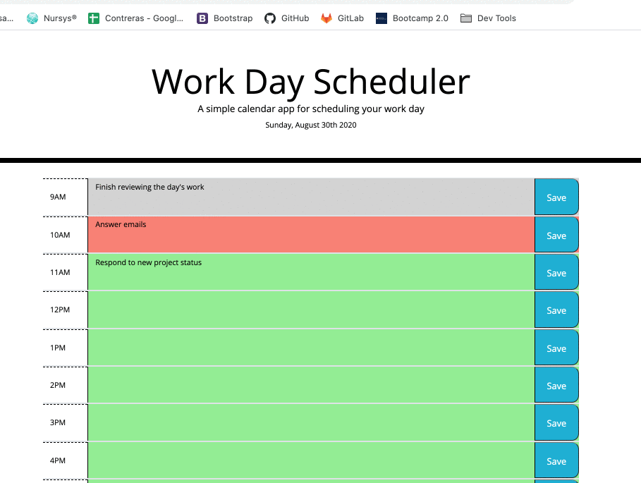

# Work Day Scheduler Starter Code

Work Day Scheduler is a scheduler where you can add tasks for a single day. The color of each time block is set as follows:

- Gray = Past Due
- Red = Current
- Green = Future

All saved items will be saved to the local storage so that you can navigate away from the page and still have information saved.

## User Story
**As an** employee with a busy schedule, **I want** to add important events to a daily planner **so that** I can manage my time effectively.

## Frameworks/Packages
- jQuery
- Bootstrap

## Screen Recording
